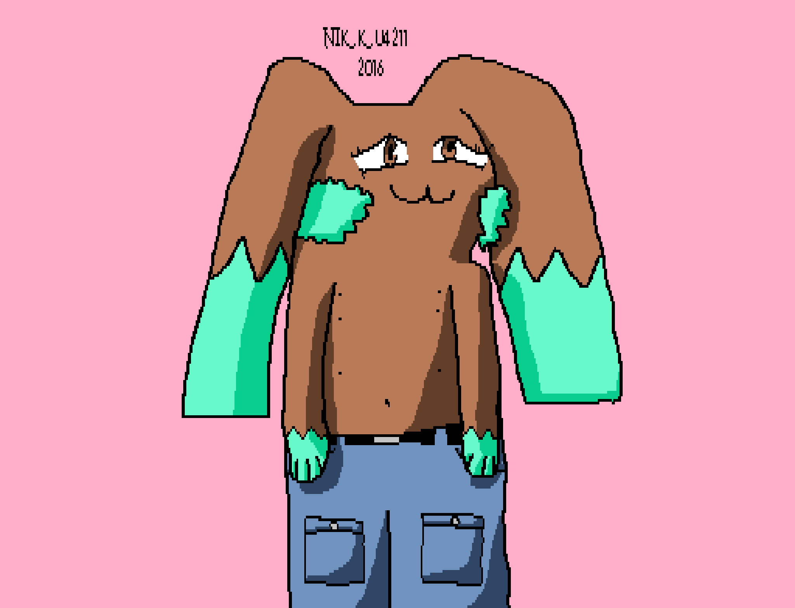
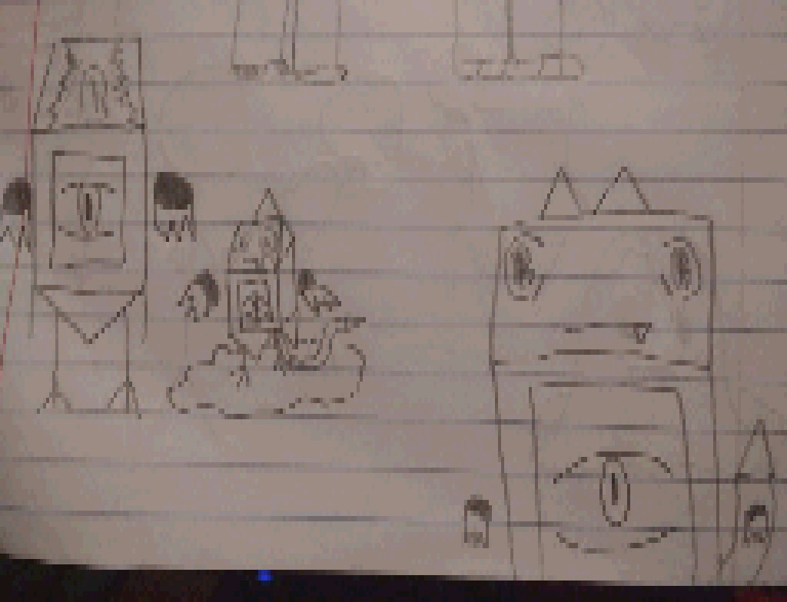

# SNEsperiments
My little experiments for the SNES.

Most of them require [LibSFX](https://github.com/Optiroc/libSFX).

<h3>4Beep</h3>

[(4Beep art from Something Nerdy Studios' House of Truth demo on NES.)](https://somethingnerdy.com/downloads/)

<h3>DVDS</h3>

<h3>HewwoHR</h3>

<h3>NSEVN</h3>

<h3>gokudrip</h3>

<h3>LibVin</h3>

